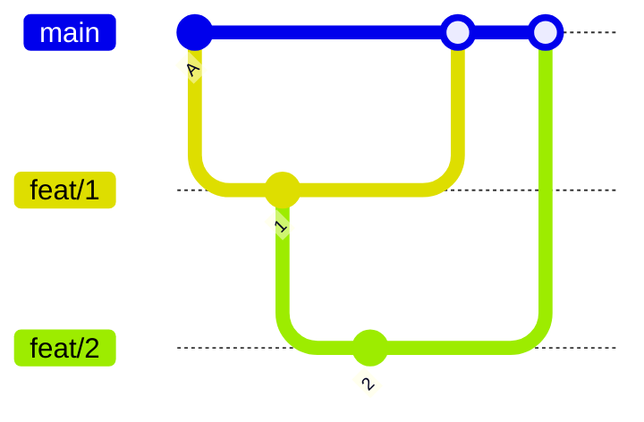
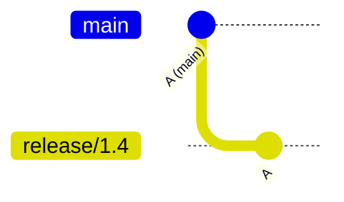
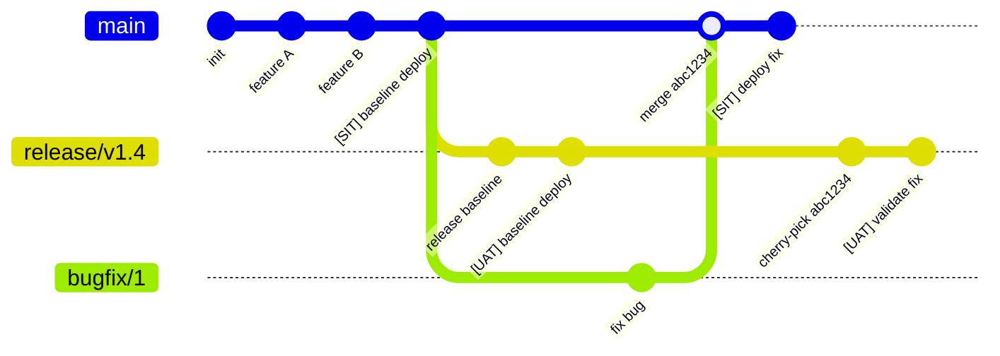
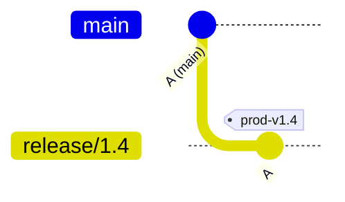
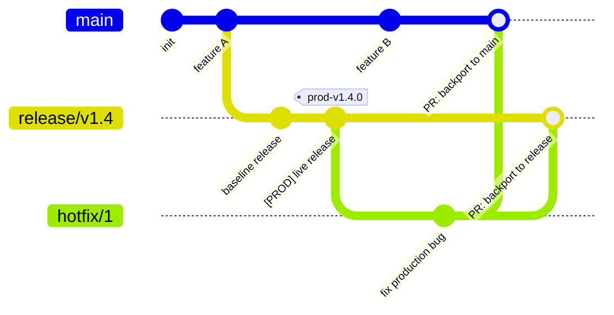

# GitLab Flow with Release Branches

## Acronyms

| Acronym | Definition | Description |
| :--- | :--- | :--- |
| **MBS** | Main Branch to SIT | GitHub Action workflow that deploys the `main` branch continuously to the SIT environment. |
| **RBUPP** | Release Branch $\rightarrow$ UAT $\rightarrow$ Pre-prod $\rightarrow$ Production | GitHub Action workflow that manages the progressive deployment of a release branch across environments. |
| **HBPP** | Hotfix Branch $\rightarrow$ Pre-prod $\rightarrow$ Production | GitHub Action workflow that deploys hotfix branches to Pre-Prod and Prod, safely bypassing SIT and UAT. |
| **DoD** | Definition of Done | The criteria that must be met before a backlog item is considered complete. |


***


## Core Characteristics & Strategy

* **Version Management:** In standard GitLab flow, a release branch tracks a minor version series (e.g., `release/v1.4` handles versions `1.4.0`, `1.4.1`, `1.4.2`, etc.). Patch increments are managed via **Git tags**, not by creating new branches.
* **Branch Lifespan:** A release branch is long-lived for the duration of that version's lifecycle and accumulates fixes over time.
* **Upstream First Philosophy:** GitLab heavily advocates fixing bugs upstream first. Both approaches below are valid depending on the scenario:
    * **Upstream First (`main` $\rightarrow$ Release):** *Default Approach.* Use this if the bug exists in both `main` and the release branch, provided the code hasn't diverged enough to cause massive merge conflicts.
    * **Release First (Release $\rightarrow$ `main`):** *Exception Approach.* Use this only if the bug is strictly isolated to the release branch (e.g., integration quirks unique to that release package) or if `main` has undergone major architectural changes that prevent clean cherry-picking. Fix it where it's broken first, then manually adapt it to `main`.

### Supported Scenarios
* Orchestrates 4 distinct environments: **SIT, UAT, Pre-Production, and Production**.
* Handles target bug fixes originating from UAT/Pre-Prod testing.
* Provides a fast-track lane for Production Hotfixes.
* Seamlessly supports maintaining multiple system versions concurrently.

### Branches in Play
* `main` (The continuous integration line)
* `feat/*` (Short-lived feature branches)
* `bugfix/*` (Short-lived bug mitigation branches)
* `hotfix/*` (Emergency production fix branches)
* `release/v*.*` (Stable deployment tracks)

---
<br />

# Release Flow Scenario

<br />


<br />
<br />

## 1. New Feature Workflow

### Branching Flow

`main` $\rightarrow$ Create `feat/1` $\rightarrow$ Merge `feat/1` into `main` $\rightarrow$ Delete `feat/1`




<br />

### Developer Pseudo Flow 


<br />

```bash

# 1. Start on main and ensure it is up to date
git checkout main
git pull origin main

# 2. Create and switch to the new feature branch
git checkout -b feat/1

# [Make code changes and commit them here]

# 3. Merge feature branch back into main via Pull Request
git checkout main
git pull origin main          # Fetch latest remote changes
git merge feat/1              # Fast-forward or merge commit

# 4. Clean up the feature branch
git branch -d feat/1              # Delete locally
git push origin --delete feat/1   # Delete from remote repository
```

### Notes

* Each backlog item must strictly meet the DoD before merging.
* Pull Requests (PRs) should always reference their corresponding issue number (Base: main ← Compare: feat/1).
* The MBS Pipeline automatically triggers a continuous deployment to SIT on every push to main to catch integration or build failures early.
* Best Practice: Ensure automated API and UI testing suites run inside the pipeline to guard against regressions.

<br />

## 2. UAT Release Workflow

### Branching Flow 

`main` $\rightarrow$ Create `release/v1.4` branch



### Developer Pseudo Flow

<br />


<br />

```bash

# 1. Ensure your local main branch matches remote tracking
git checkout main
git pull origin main

# 2. Cut the release branch from main
git checkout -b release/v1.4

# 3. Push the release branch upstream to trigger UAT deployment
git push -u origin release/v1.4

```

### When

<b>Release Thursday</b> - Every Thursday at 2:00 PM

### How
  1. The DevOps Lead broadcasts a main branch freeze to the team.
  2. `main` remains frozen (verbally/chat announced, 1–2 hours maximum). No feature branch PR merges are permitted during this window.
  3. Cut the new release/v1.4 branch directly from the frozen main baseline.
  4. The <b>RBUPP Pipeline</b> detects the new branch and automatically deploys it to the UAT environment.
  5. Run automated and manual smoke tests to validate the UAT deployment state.
  6. Once the UAT deployment is verified as successful, the DevOps Lead officially declares main open for feature merges again.

<br />
<br />

## 3. UAT / Pre-Production Bug Fix Workflow

### Branching Flow

`main` $\rightarrow$ Create `bugfix/1` $\rightarrow$ Merge to `main` $\rightarrow$ `Cherry-pick commit hash` $\rightarrow$ Apply to `release/v1.4`

<br />



<br />

### Developer Pseudo Flow


<br />

```bash

# 1. Download tracking info for all branches from the remote repository
git fetch origin

# 2. Branch from main to isolate and fix the bug
git checkout main
git checkout -b bugfix/1

# [Make code changes and commit your fix]

# 3. Open a PR to merge bugfix/1 into main
git checkout main
git merge bugfix/1
git push origin main

# 4. The MBS pipeline automatically deploys this fix to SIT for baseline validation

# 5. Extract the specific merge commit hash from main for cherry-picking
git log -1

# 6. Switch to the release branch and cherry-pick the fix
git checkout release/v1.4
git cherry-pick <insert-commit-hash-abc1234>
git push origin release/v1.4

# 7. The RBUPP Pipeline deploys the updated release branch straight to UAT
# 8. Verify and sign off on the bug fix inside the UAT environment

```

<br />
<br />

## 4. User Feedbacks for UAT, Pre-Production and Production

### Notes

non-critical UAT bugs, feedbacks from UAT, Pre-Production and Production can record as backlog items and let sprint planning decide when to work on feedbacks

<br />
<br />

## 5. Pre-Production Release Workflow

### Branching Flow

Reuses same existing release/v1.4 branch

### How

1. Stakeholders/Customers conduct formal code reviews for all unique commits accumulated within the release/v1.4 branch.

2. Dev Crew manually triggers `Approval` step in <b>RBUPP Pipeline <b/> stage to promote the code safely into the Pre-Production environment.

### Notes

If a bug is found during Pre-Production testing, follow the exact same UAT Bug Fix cherry-pick procedure outlined in Section 3, followed by a manual approval step to redeploy to Pre-Production

<br />
<br />

## 6. Production Release Workflow

### Branching Flow

Reuses existing `release/v1.4` branch $\rightarrow$ Generates immutable Production `Tag prod-v1.4.0`
		


<br />

### Developer Pseudo Flow:


<br />

### How

1. The customer reviews the Pre-Prod state and officially declares that release/v1.4 is ready for Production deployment.
2. The customer reviews and provides the manual "Approve" signature within the production stage of the RBUPP Pipeline.
3. The pipeline proceeds with the deployment to Production.
4. Automated Tagging: Upon a verified, successful deployment, the RBUPP Pipeline automatically creates and pushes the immutable production release tag (prod-v1.4.0).

### Notes

* The pipeline must only generate the Git tag after the production deployment is entirely successful

<br />
<br />

## 7. Production Emergency Hotfix Workflow

### Branching Flow
Production Tag `prod-v1.4.0` $\rightarrow$ Create temporary `hotfix/1` branch $\rightarrow$ Deploy via `HBPP Pipeline` $\rightarrow$ Generate incremental Production Tag `prod-v1.4.1` $\rightarrow$ Merge `hotfix/1` back to `main` and `release/v1.4`

<br />



### Developer Pseudo Flow

<br />


<br />

```bash

# 1. Fetch latest tags and cut a hotfix branch directly from the active production tag
git fetch --tags
git checkout -b hotfix/1 prod-v1.4.0

# [Apply critical hotfix code changes and commit them]

# 2. Push the hotfix branch to origin
git push origin hotfix/1  

# 3. Pushing triggers the HBPP Pipeline, which automatically deploys hotfix/1 to Pre-Production
# 4. The Dev Crew reviews and manually grants "Approval" inside the Pre-Prod pipeline stage
# 5. The customer validates the fix in Pre-Prod and issues a passing status
# 6. The customer provides the final manual "Approval" for the Production stage
# 7. The HBPP pipeline completes the deployment job to the live Production servers

# 8. Post-deployment, the pipeline automatically generates and pushes the updated patch tag
git tag prod-v1.4.1
git push origin prod-v1.4.1

# 9. BACKPORT STEP A: Open a PR to merge the hotfix changes permanently into main
git checkout main
git pull origin main
git merge hotfix/1
git push origin main

# 10. BACKPORT STEP B: Open a PR to merge the hotfix changes back into the active release branch
git checkout release/v1.4
git pull origin release/v1.4
git merge hotfix/1
git push origin release/v1.4

```
